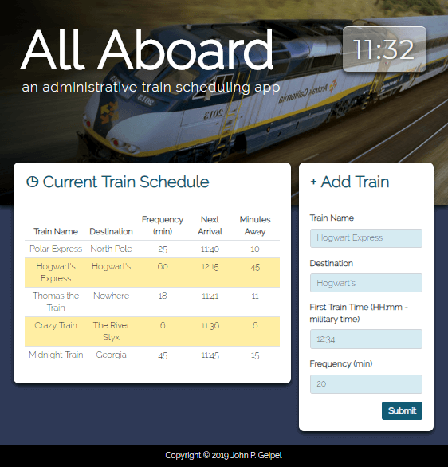

# All Aboard
**an administrative train scheduling app**

https://johnpgeipel.github.io/train_activity/

 - **All Aboard** is an application designed to accept and post scheduling information.
 
 - The user enters:
    - **Train Name**
    - **Destination**
    - **First Train (HH:mm)** *in military time*
    - **Frequency of Train** *in minutes*
    
- Using Google Firebase, JQuery & Moment.js, this information is stored in a database and processed to calculate and display the following:
    - **Train Name**
    - **Destination**
    - **Frequncy**
    - **Time of Next Arrival**
    - **Minutes Until Next Arrival**
    
- This application utilizes ***HTML, CSS, Bootstrap, JavaScript, Moment.js, JQuery, AJAX & Google Firebase Database.***
